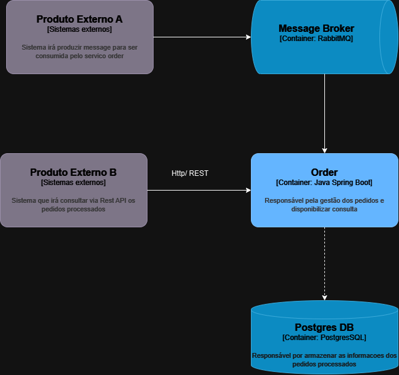

# Aplicação de Gerenciamento de Pedidos

Este é um serviço de gerenciamento de pedidos construído com Spring Boot, utilizando arquitetura hexagonal (Ports and Adapters) e persistência com JPA/Hibernate.

## Funcionalidades

* Criação e processamento de pedidos.
* Busca de pedidos por status.
* Persistência de pedidos e itens de pedido em banco de dados.

## Tecnologias

* Java 21
* Spring Boot 3.4.3
* RabbitMQ
* JPA/Hibernate
* JUnit 5
* Mockito
* PostgreSQL

## Arquitetura

A aplicação segue a arquitetura hexagonal (Ports and Adapters), separando o domínio da aplicação das dependências externas.

* **Domínio:** Contém as regras de negócio e os modelos de domínio (Order, OrderItem).
* **Ports:** Define interfaces para interações com o mundo externo (adapters).
* **Adapters:** Implementa as interfaces de ports para interagir com bancos de dados, etc.

## Diagrama C4



## Como Executar a Aplicação

1.  **Pré-requisitos:**
    * Java 21
    * Docker
    * Maven

2.  **Configuração:**
    * Execute Docker Compose:

        ```bash
        docker-compose up -d --build
        ```

    * Configure as propriedades de conexão do banco de dados no arquivo `application.yml`.

## Message Broker (RabbitMQ)

* **Criar queue:**
  * orderQueue

  * Publicar seguinte mensagem para testar consumer
  
     ```
     {
      "externalId": "12312425",
      "items": [
        {
          "productCode": "ABC123",
          "productName": "Produto Exemplo",
          "price": 1000.00,
          "quantity": 2
        },
        {
          "productCode": "XYZ789",
          "productName": "Outro Produto",
          "price": 49.50,
          "quantity": 1
        }
      ]
    }
    
     ```
## Endpoints da API

* **Buscar Pedidos por Status:**
    * `GET /orders?status={status}`
    * Recebe o status como parâmetro de consulta.
    * Retorna uma lista de pedidos com o status especificado.


## Contribuição

Contribuições são bem-vindas! Sinta-se à vontade para abrir issues e pull requests.